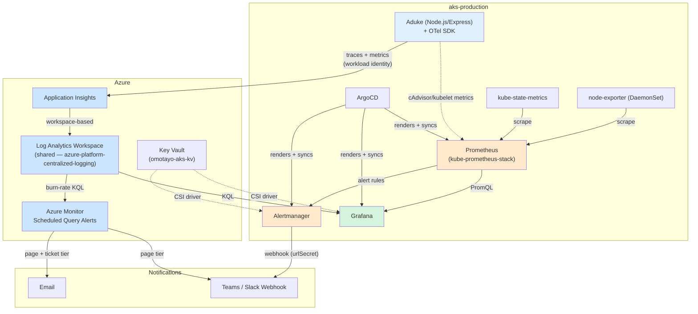
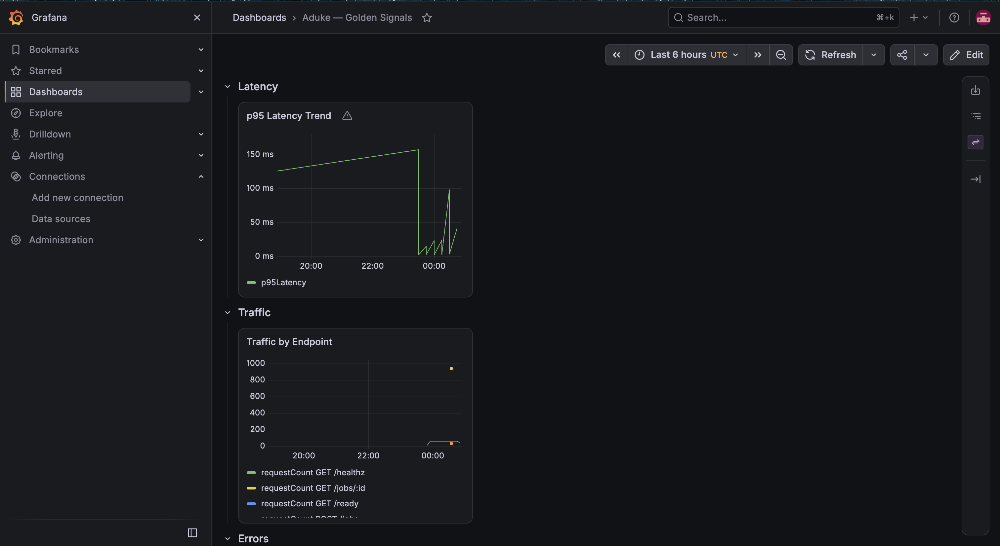
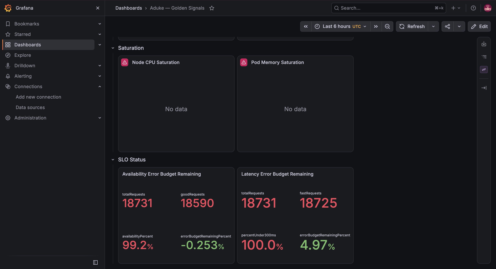
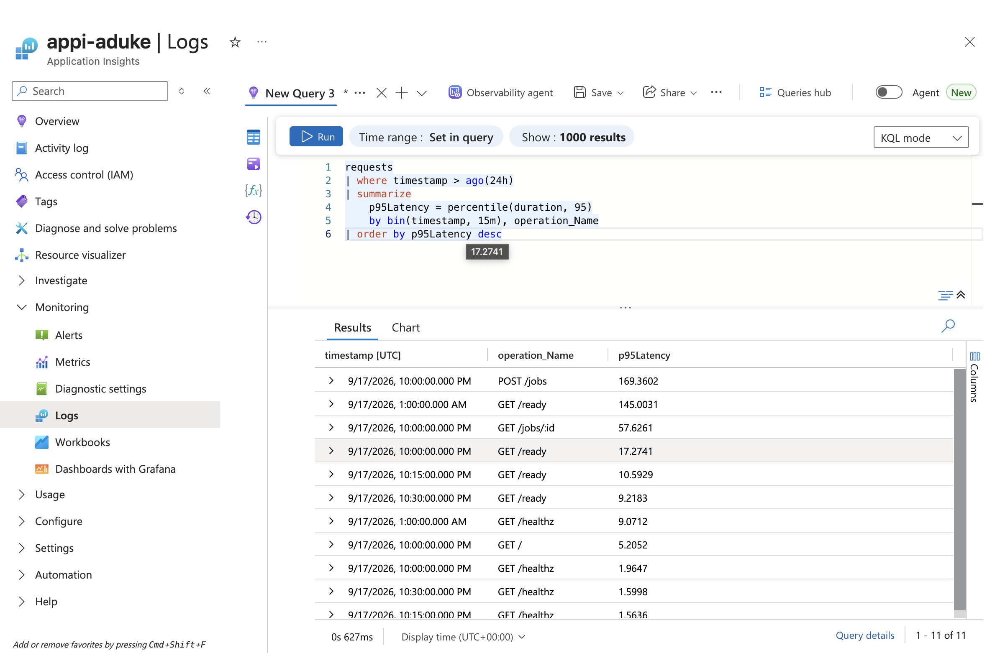
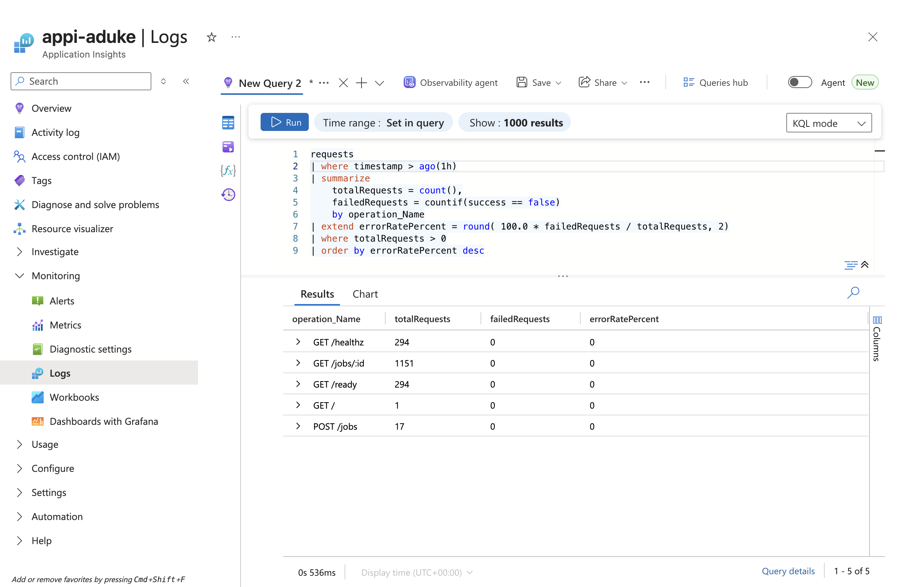
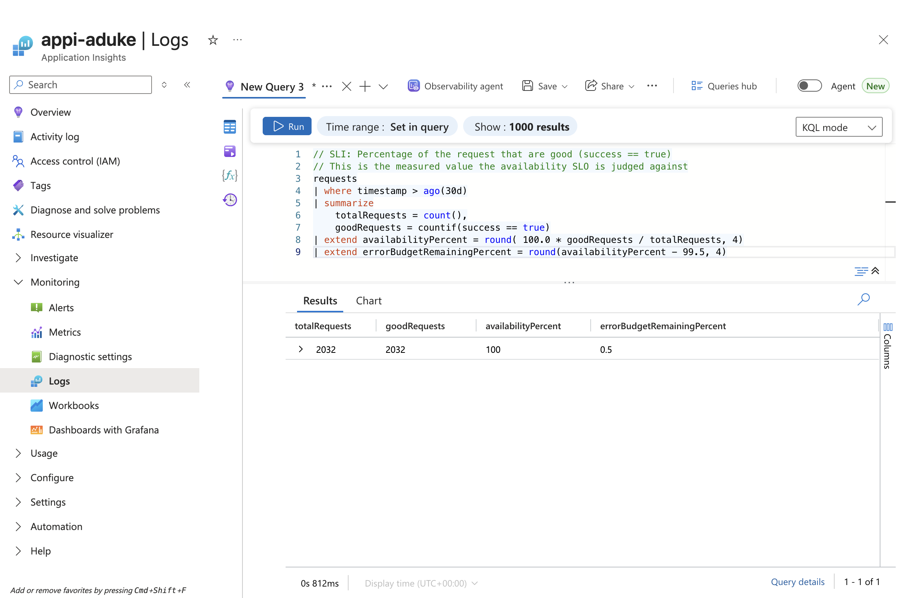
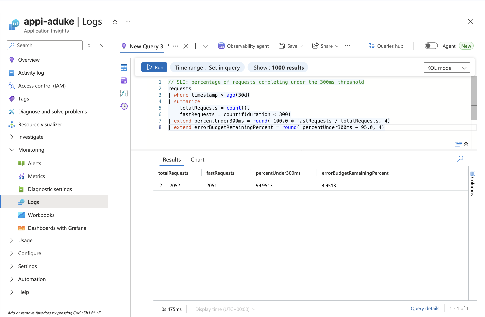

# azure-aks-observability-platform

Full observability stack for **Aduke**, an app running on `aks-production` —
Application Insights + Log Analytics for app-level telemetry, Prometheus +
Grafana for infrastructure telemetry, SLO-driven error-budget alerting,
and a real, timed incident response exercise.

## Why this exists

Most observability demos stop at "here's a dashboard." This project goes
further: it defines actual Service Level Objectives against real signals,
calculates the error budget those SLOs imply, builds multi-tier burn-rate
alerting (not just static thresholds) modeled on Google's published SRE
methodology, and proves the whole thing works by deliberately breaking
the app, timing the alert-to-mitigation response against a written
runbook, and documenting the results in a real postmortem.

## Architecture

A deliberate hybrid, not a single-vendor default:

- **Application Insights + Log Analytics (KQL)** — Aduke's own telemetry
  (latency, traffic, errors), instrumented via OpenTelemetry, authenticated
  via Azure Workload Identity (no connection strings, no stored secrets).
- **Prometheus + Grafana (PromQL)** — cluster/infrastructure telemetry
  (CPU, memory, pod health), deployed in-cluster via `kube-prometheus-stack`,
  managed through ArgoCD's app-of-apps pattern.
- **Grafana** — the single pane of glass, querying both sources side by
  side, dashboards defined as code (Grafonnet, not a UI-exported blob) so
  panels reference the exact same query files used for ad-hoc investigation.

The Log Analytics workspace itself is shared platform infrastructure,
provisioned independently in
[`azure-platform-centralized-logging`](https://github.com/GreatOmotayo/azure-platform-centralized-logging)
and consumed here via `terraform_remote_state`.

### Diagram



## Screenshots

| | |
|---|---|
|  |  |
|  |  |
|  |  |

## SLOs

| SLO | Target | Error budget (30-day) |
|---|---|---|
| Availability | 99.5% success rate | 216 minutes |
| Latency | 95% of requests < 300ms | 5% of requests |

Both SLOs are backed by multi-window, multi-burn-rate alerting (Google
SRE model): a fast window (5m) and slow window (1h) must **both** breach
14.4x burn rate before paging (Teams + email); a second, lower-urgency
tier (6x, 30m/6h windows) routes to email only. See `DECISIONS.md` for
the full derivation of both thresholds.

## Incident response

Two runbooks, each tuned to a genuinely different failure signature:
- `runbook/api-error-rate-spike.md` — diagnosis leans on exception data
- `runbook/latency-degradation.md` — diagnosis leans on dependency call
  duration and infra saturation, since a slow-but-successful request
  leaves no exception trail

Both were validated with a real, self-induced incident — see
`runbook/fault-injection-plan.md` for the exercise and
`postmortem/` for the real, timed results.

## Repo structure

```
terraform/    — App Insights, role assignments, Grafana's dedicated identity
charts/       — Helm chart wrapping kube-prometheus-stack, custom
                SecretProviderClasses, AlertmanagerConfig CRD, Grafonnet dashboard
gitops/       — ArgoCD app-of-apps manifests
queries/kql/  — Application Insights queries (golden signals + SLIs)
queries/ql/   — Prometheus queries (saturation + burn-rate forecast)
alerts/       — Azure Monitor multi-tier burn-rate alert rules
runbook/      — incident response docs + the fault injection plan
postmortem/   — real, timed incident writeup
screenshots/  — dashboard and query result captures for this README
```

## Documentation

- `DECISIONS.md` — every architectural choice, in the order made, including
  the ones that were revised
- `DEPLOYMENT.md` — the actual mechanics of how this chart becomes running
  pods (Helm subchart rendering + ArgoCD app-of-apps, step by step)
- `VALIDATION.md` — step-by-step deployment and validation checklist
- `TROUBLESHOOTING.md` — real issues hit during this build

## CI/CD

Same pattern as every repo in this portfolio: OIDC via a shared app
registration (`portfolio-terraform-deployer`), `terraform plan` on PR,
`terraform apply` on merge behind a manual approval gate, no stored
secrets anywhere.

## Part of a larger portfolio

Final project in a five-project Tier 1 sequence: Landing Zone →
Hub-and-Spoke Zero-Trust Networking → Policy-as-Code Pipeline → AKS
Platform → this project.